<div align="center">
  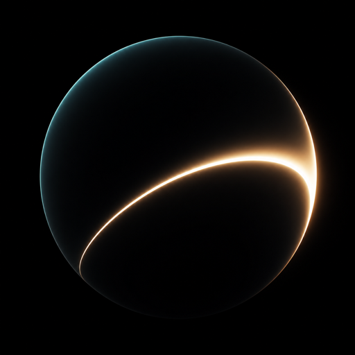
  <h1>Shape of the World</h1>
  <p>
    <a href="./README.md">English</a> · <a href="./README.zh.md">中文</a>
  </p>
  <p>
    <strong>The World, Playable</strong><br>
    A playable universe of knowledge.
  </p>
  <p>
    See how the world works.<br>
    Change a variable. Watch the world respond.
  </p>
  <p>
    <a href="https://open.shapeof.world">Live demo</a>
    ·
    <a href="https://shapeof.world">Full collection</a>
  </p>
  <p>This repository is a <strong>curated edition</strong>: thirty worlds and the web code that runs them.</p>
</div>

## Sponsor

<div align="center">
  <p>Sponsored by 叠加态社区 (SUPERPOSITION).</p>
  <picture>
    <source media="(prefers-color-scheme: dark)" srcset="./public/assets/sponsors/superposition-white.svg">
    
  </picture>
  <p><sub>See the <a href="./public/assets/sponsors/NOTICE.md">asset notice</a>.</sub></p>
</div>

## Worlds

<table align="center">
  <tr>
    <td align="center" width="20%">
      <a href="https://open.shapeof.world/explore/moon-voyage">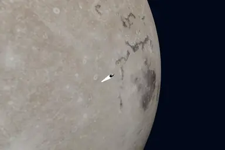</a>
    </td>
    <td align="center" width="20%">
      <a href="https://open.shapeof.world/explore/black-hole-flyby">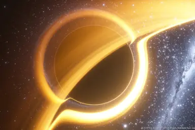</a>
    </td>
    <td align="center" width="20%">
      <a href="https://open.shapeof.world/explore/formula-bloom">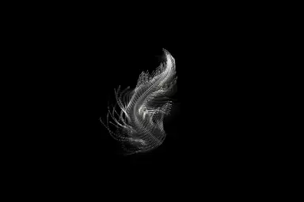</a>
    </td>
    <td align="center" width="20%">
      <a href="https://open.shapeof.world/explore/double-slit">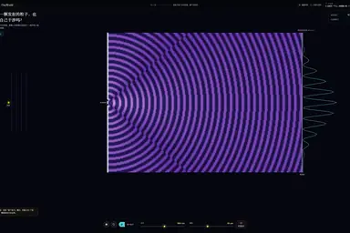</a>
    </td>
    <td align="center" width="20%">
      <a href="https://open.shapeof.world/explore/pendulum-wave">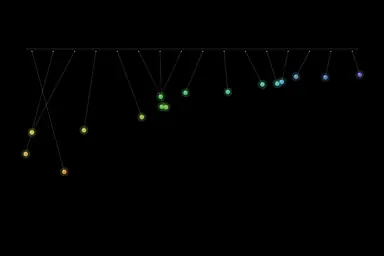</a>
    </td>
  </tr>
  <tr>
    <td align="center" width="20%">
      <a href="https://open.shapeof.world/explore/double-pendulum">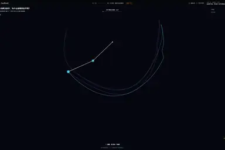</a>
    </td>
    <td align="center" width="20%">
      <a href="https://open.shapeof.world/explore/firefly-sync">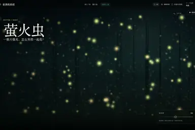</a>
    </td>
    <td align="center" width="20%">
      <a href="https://open.shapeof.world/explore/chemical-garden">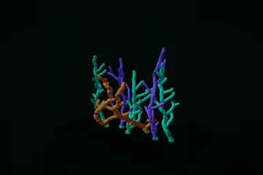</a>
    </td>
    <td align="center" width="20%">
      <a href="https://open.shapeof.world/explore/neural-playground">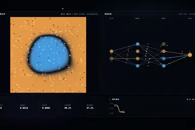</a>
    </td>
    <td align="center" width="20%">
      <a href="https://open.shapeof.world/explore/robot-ik">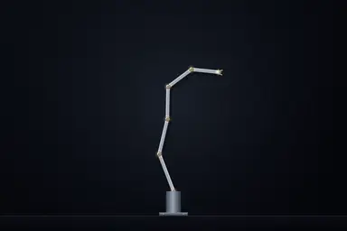</a>
    </td>
  </tr>
  <tr>
    <td align="center" width="20%">
      <a href="https://open.shapeof.world/explore/solar-system">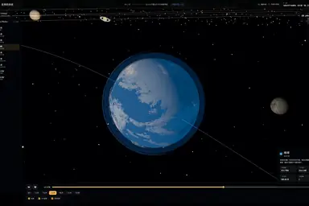</a>
    </td>
    <td align="center" width="20%">
      <a href="https://open.shapeof.world/explore/three-body">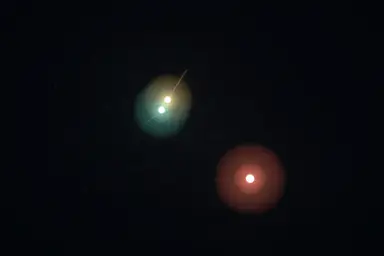</a>
    </td>
    <td align="center" width="20%">
      <a href="https://open.shapeof.world/explore/gravity-assist">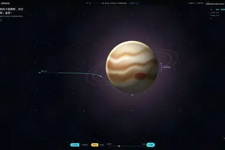</a>
    </td>
    <td align="center" width="20%">
      <a href="https://open.shapeof.world/explore/mandelbrot-zoom">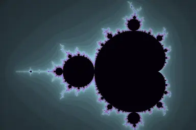</a>
    </td>
    <td align="center" width="20%">
      <a href="https://open.shapeof.world/explore/newton-fractal">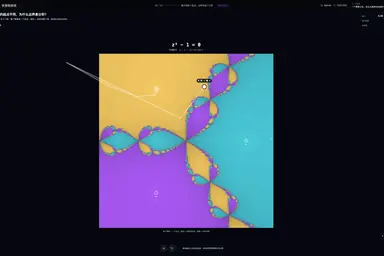</a>
    </td>
  </tr>
  <tr>
    <td align="center" width="20%">
      <a href="https://open.shapeof.world/explore/clifford-dust">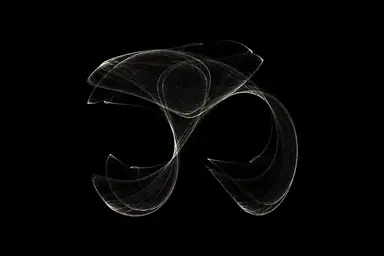</a>
    </td>
    <td align="center" width="20%">
      <a href="https://open.shapeof.world/explore/kakeya-needle">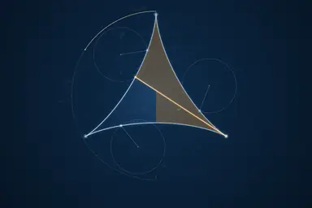</a>
    </td>
    <td align="center" width="20%">
      <a href="https://open.shapeof.world/explore/strange-attractors">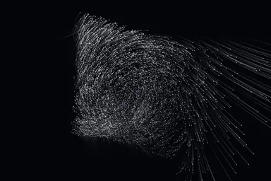</a>
    </td>
    <td align="center" width="20%">
      <a href="https://open.shapeof.world/explore/fluid-sim">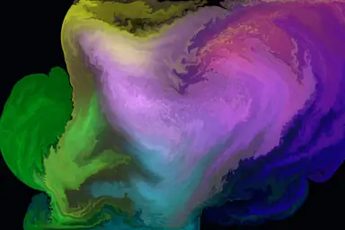</a>
    </td>
    <td align="center" width="20%">
      <a href="https://open.shapeof.world/explore/electric-field">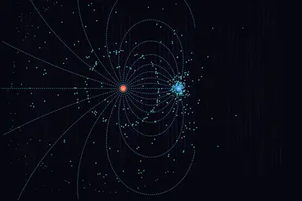</a>
    </td>
  </tr>
  <tr>
    <td align="center" width="20%">
      <a href="https://open.shapeof.world/explore/magnetic-lines">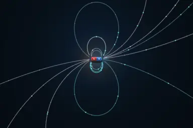</a>
    </td>
    <td align="center" width="20%">
      <a href="https://open.shapeof.world/explore/fourier">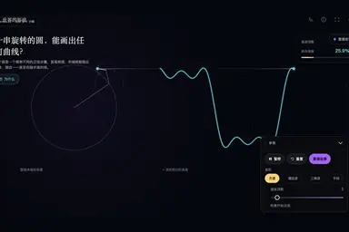</a>
    </td>
    <td align="center" width="20%">
      <a href="https://open.shapeof.world/explore/ferrofluid">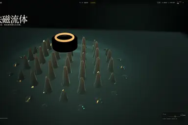</a>
    </td>
    <td align="center" width="20%">
      <a href="https://open.shapeof.world/explore/soap-bubble">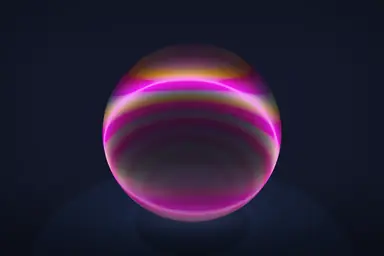</a>
    </td>
    <td align="center" width="20%">
      <a href="https://open.shapeof.world/explore/pool-caustics">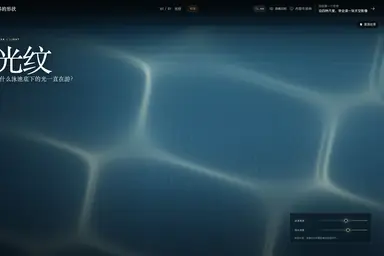</a>
    </td>
  </tr>
  <tr>
    <td align="center" width="20%">
      <a href="https://open.shapeof.world/explore/pinhole-canopy">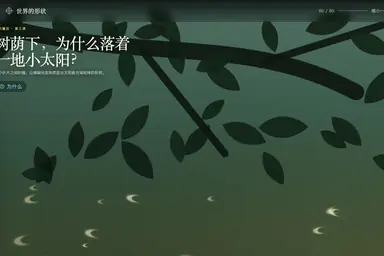</a>
    </td>
    <td align="center" width="20%">
      <a href="https://open.shapeof.world/explore/lightning-lab">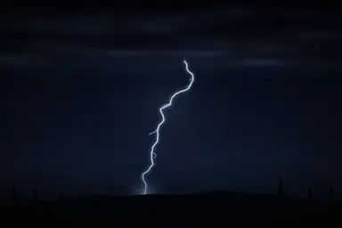</a>
    </td>
    <td align="center" width="20%">
      <a href="https://open.shapeof.world/explore/snow-crystal">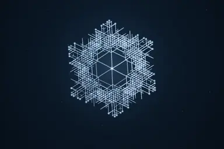</a>
    </td>
    <td align="center" width="20%">
      <a href="https://open.shapeof.world/explore/boids-flocking">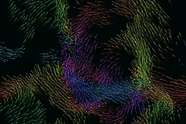</a>
    </td>
    <td align="center" width="20%">
      <a href="https://open.shapeof.world/explore/phyllotaxis">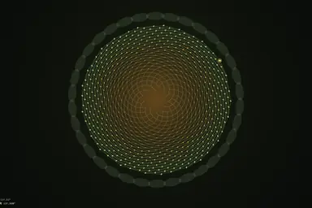</a>
    </td>
  </tr>
</table>

Open a poster to play it. Each world has Simplified Chinese and English copy, posters, and source notes.

## People

<table align="center">
  <tr>
    <td align="center" valign="top" width="180">
      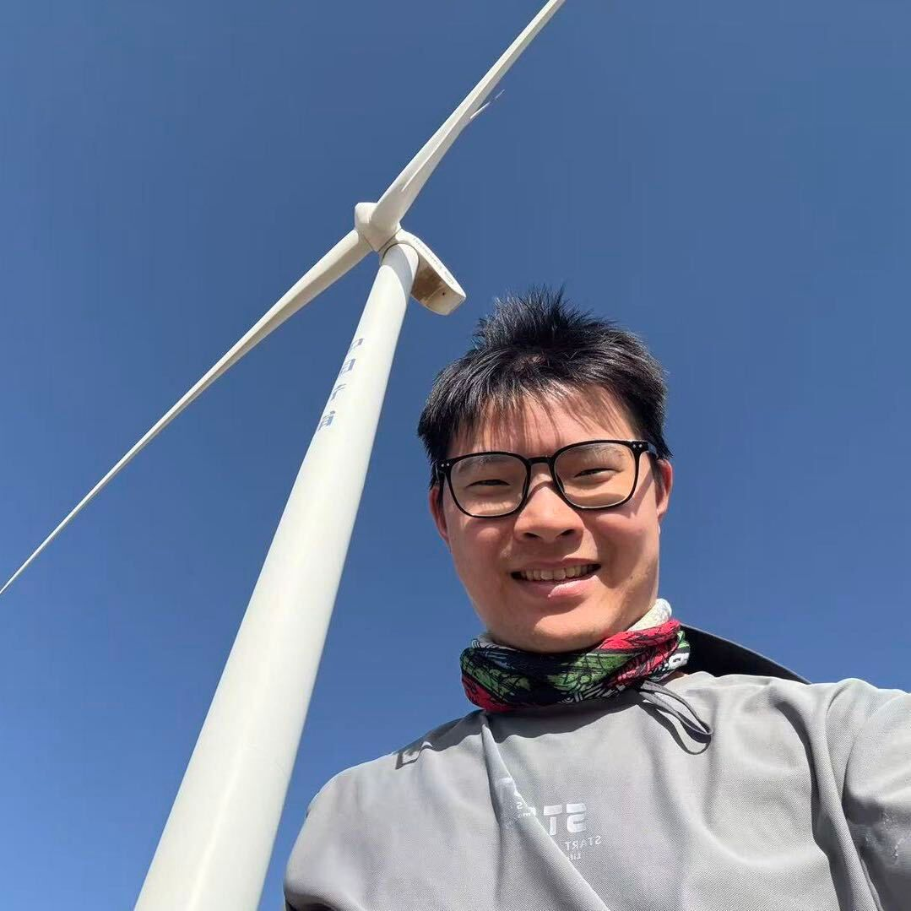<br>
      <strong>Maker Jackie</strong><br>
      Independent developer<br>
      <a href="https://makerjackie.com">makerjackie.com</a>
    </td>
    <td align="center" valign="top" width="180">
      <br>
      <strong>Yu</strong><br>
      Product design<br>
      <a href="https://yusually.it.com/">yusually.it.com</a>
    </td>
  </tr>
</table>

## Run locally

Requires Node.js 24 and pnpm 10+.

```sh
pnpm install
pnpm dev
```

Open `http://localhost:3000`. No API key is required.

```sh
pnpm check
```

That command type-checks, tests, and builds.

## License

- Project-controlled software: [AGPL-3.0-only](./LICENSE)
- Original editorial and visual work the project clearly owns: [CC BY-NC 4.0](./CONTENT_LICENSE.md)
- Third-party code, data, models, images, fonts, and audio keep their own licenses. See [OSS_NOTICES.md](./OSS_NOTICES.md) and [DATA_SOURCES.md](./DATA_SOURCES.md)
- “Shape of the World / 世界的形状”, the logo, and the app identity are not licensed with the code or content. See [TRADEMARKS.md](./TRADEMARKS.md)

The compass mark is Phosphor Icons’ [`CompassRose`](https://phosphoricons.com/) (MIT). See [LICENSE-phosphor-icons.txt](./public/assets/oss-source/LICENSE-phosphor-icons.txt).

Full terms: [LICENSING.md](./LICENSING.md), [COMMERCIAL_LICENSE.md](./COMMERCIAL_LICENSE.md), [PROJECT_OWNED_CONTENT.md](./PROJECT_OWNED_CONTENT.md). This summary is for orientation only and is not legal advice.

## Contributing

See [CONTRIBUTING.md](./CONTRIBUTING.md).
